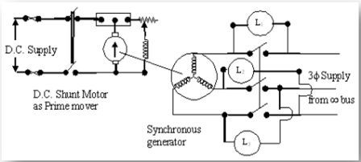

## Procedure of the Experiment – 1

### Procedural Steps

1. Make the connections.  

2. Run one of the alternators and adjust its voltage to the rated value. Then close the switch to connect it with the bus bar.

3. Start the second set (incoming machine 2) and bring it up to proper speed equal to that of the running machine (bus bar voltage).

4. Synchronize the incoming machine using any one synchronization method.

---

## Connection Diagram of Experiment – 1

**Connection diagram for synchronizing the alternator with 3-lamp method**
