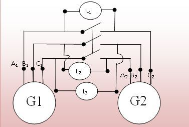
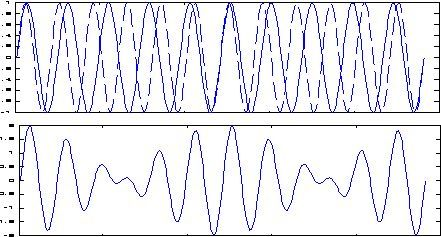
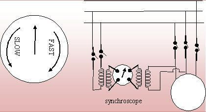
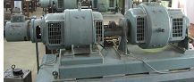
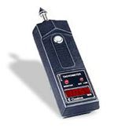

<!DOCTYPE html>
<html>

</head>

<body>

<h2>Theory </h2>

Before synchronization, the following conditions must be satisfied:

<h3>1. Equality of Voltage</h3>

The terminal voltage of both the systems i.e., the incoming alternator and the bus bar
voltage (or other alternator) must be the same.

<h3>2. Phase Sequence</h3>

The phase sequence of both the systems must be the same.

<h3>3. Equality of Frequency</h3>

The frequency of both the systems must be the same. Voltage equality can be checked
using a voltmeter, while phase sequence and frequency are checked using synchronizing methods.

Two synchronizing methods are commonly used:

<ol>
<li>Using incandescent lamps</li>
<li>Using synchroscope</li>
</ol>

<h3>(a) Using Incandescent Lamp Method</h3>

Let machine G2 be synchronized with machine G1 already connected to the bus bar
using three lamps (L1, L2, L3). These lamps are known as synchronizing lamps.

  

Fig. 1 Synchronization using three lamp method

If machine G2 speed is not equal to machine G1, frequencies differ and phase difference
appears between voltages. As a result, lamps flicker alternately bright and dark.
Synchronization is done during the middle of the dark period. This is called the
<b>Dark Lamp Method</b>.

  

Fig. 2 Waveforms when two systems operate at different frequencies

Lamp L1 is connected between A1–A2, L2 between B1–C2, and L3 between C1–B2.
These lamps brighten and darken cyclically depending on whether machine G2
is running fast or slow.

The synchronizing switch is closed when lamp L1 becomes completely dark.
This arrangement also indicates whether the incoming machine is slow or fast.

<h4>Drawbacks of Lamp Method</h4>

<ol>
<li>Lamps become dark at about one-third rated voltage, causing faulty synchronization.</li>
<li>Cannot determine how much the machine is slow or fast.</li>
<li>Not suitable for high-voltage alternators without step-down transformers.</li>
</ol>

<h3>(b) Synchronization by Synchroscope</h3>

A synchroscope indicates the correct instant of closing the synchronizing switch using a rotating pointer.

<ul>
<li>Pointer rotates clockwise → Incoming machine is fast</li>
<li>Pointer rotates anticlockwise → Incoming machine is slow</li>
</ul>

  
  
Fig. 3 Synchronizing by Synchroscope

  
## Equipments Required

| Equipment | Image |
|:---|:---:|
| **DC Motor – Alternator Set** |  |
| **AC Voltmeter** |  |
| **Rheostat** |  |
| **Tachometer** |  |

